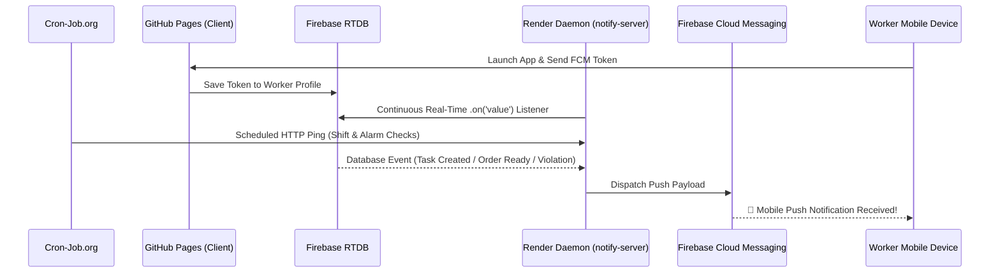

# 🚀 MVC Fresh / Burgeroov Dashboard — Comprehensive Master Architecture Guide

This document is the **authoritative technical guide** for the MVC Fresh / Burgeroov Management Portal & Customer Application. Any developer or AI coding agent working on this codebase MUST read this document to understand the system architecture, file structure, data workflows, and operational contracts.

---

## 🏛️ 1. Infrastructure & Technology Stack

| Layer | Component | Technology & Details |
| :--- | :--- | :--- |
| **Frontend UI** | SPA Shell | Vanilla HTML5, Vanilla CSS3 (Custom design system with dark/light modes), Vanilla JS (ES6+). Hosted on **GitHub Pages**. |
| **Bilingual System** | i18n Engine | Dynamic translation engine in `translations.js` supporting **Arabic (AR)** and **English (EN)** with real-time UI toggling. |
| **Database & Sync** | **Firebase RTDB** | Real-time database synchronizing owned company nodes (`companies/burgeroov`, `companies/mvc`, `companies/mvcfresh`) and customer profiles (`customerCodes`). |
| **Push Notification Server** | **Render.com (`notify-server`)** | Node.js Express server running at `https://burgeroov-notify.onrender.com`. Listens to RTDB event streams and sends mobile FCM push notifications. |
| **Automated Daemon** | **Cron-Job.org** | External scheduled runner that pings Render endpoints to trigger shift check-ins, automated daily log roll-overs, and scheduled reminder alarms. |
| **WhatsApp Gateway** | **WhatsApp Business API** | Integrated in Render daemon via Baileys API. Supports 8-Digit Pairing Codes or Live QR Scanning for automated customer & worker notifications. |

---

## 📁 2. File Organization & Build Pipeline

The frontend uses a modular JS architecture split into 11 sub-modules under `js/`. Production deployments run off `app.js`, which is generated by concatenating the source modules in dependency order.

```
dashboard/
├── index.html                  # Master SPA HTML file containing all view sections and modals
├── app.js                      # Compiled production bundle (~1.33 MB)
├── style.css                   # Theme design tokens, glassmorphism components & responsive styles
├── translations.js             # Dictionary containing AR/EN translation strings
├── js/                         # Modular Source JavaScript Files
│   ├── core.js                 # App startup, routing (switchTab), company swapping, Firebase listeners, saveData
│   ├── auth.js                 # Authentication, role permissions, Manager Access Control, customer PIN sessions
│   ├── ops.js                  # Operational dashboard, live shift clock, employee registration, system violations UI
│   ├── finance.js              # Weekly financial ledger, salary calculation, deductions, rewards, loan requests
│   ├── sales_costs.js          # Advanced Sales Analytics, cash box tracker, deposits, operational expenditure tracker
│   ├── warehouse.js            # Stock catalog, category management, low-stock threshold alerts, PDF restock generator
│   ├── tasks.js                # Task catalog, worker assignment, countdown timers, violation rules engine
│   ├── drivers.js              # Driver status board, active delivery timers, delivery order assignments
│   ├── adverts_notes.js        # Internal announcement board, team memo notes, image/voice attachments
│   ├── market.js               # Digital store catalog, customer cart, coin balance rewards
│   └── prepare.js              # Kitchen prep order queue, Workers Phone Number Matrix (WhatsApp)
└── scratch/                    # Verification scripts & automated test suites
```

### 🔨 Re-Bundling Command
Whenever editing any module inside `js/`, you MUST re-build `app.js` using Node:
```bash
node -e "const fs = require('fs'); const files = ['js/core.js', 'js/auth.js', 'js/adverts_notes.js', 'js/sales_costs.js', 'js/warehouse.js', 'js/tasks.js', 'js/drivers.js', 'js/ops.js', 'js/finance.js', 'js/market.js', 'js/prepare.js']; const bundle = files.map(f => fs.readFileSync(f, 'utf8')).join('\n\n'); fs.writeFileSync('app.js', bundle); console.log('Successfully bundled app.js (' + bundle.length + ' bytes)');"
```

---

## 📑 3. Dashboard Navigation & Functional Views

Navigation is controlled by `switchTab(tabName)` which activates the corresponding `#view-{tabName}` section:

1. **⚙️ Operations (`view-ops`)**: Daily operational home screen, shift clock-in/out, live shift duration timer, branch manager access control, system violations.
2. **🏆 Ranks (`view-ranks`)**: Employee leaderboard, rating stars, monthly performance recognition.
3. **📅 Attendance (`view-attendance`)**: Monthly clocking history, shift logs, overtime hours calculation, infraction records.
4. **📋 Tasks (`view-tasks`)**: Task catalog, worker assignment, progress states (pending/seen/done), countdown timers.
5. **📦 Warehouse (`view-warehouse`)**: Inventory catalog, category filtering, stock adjustments, low-stock alerts, PDF re-order export.
6. **🚚 Drivers (`view-drivers`)**: Driver availability status (available/delivering), delivery provision tracking, active order timers.
7. **💰 Financial (`view-finance`)**: Weekly balance sheet, worker loan requests, penalty deductions, reward bonuses, disbursal code approvals.
8. **📊 Summary (`view-summary`)**: High-level KPI dashboards, profit & loss summaries, monthly statistics.
9. **📢 Ads (`view-adverts`)**: Internal company news broadcasts, announcement banners.
10. **📝 Notes (`view-notes`)**: Team memo board with image & voice note recording attachments.
11. **📜 Activity Log (`view-activity`)** *(Admin-Only)*: Audit trail logging critical system modifications.
12. **💰 Sales (`view-managing`)**: Sales analytics dashboard, past-day sales entry, cash deposits, direct spend entries.
13. **📉 Costs (`view-costs`)**: Operational expenses log, cost category breakdown.
14. **⏰ Reminders (`view-reminders`)** *(Admin-Only)*: System alarm scheduler & alert notifications.
15. **🏪 Market (`view-market`)**: Product store catalog for customers and workers to browse items or redeem coins.
16. **👨‍🍳 Prepare (`view-prepare`)**: Kitchen prep queue for orders, Workers Phone Number Matrix for WhatsApp gateway.
17. **💬 Messaging (`view-messaging`)**: WhatsApp Business connection gateway (QR Code / 8-Digit Pairing Code).
18. **📁 Informations (`view-vault`)**: Document & license storage vault with custom folder organization.
19. **🤖 AI Assistant (`view-ai-assistant`)**: Integrated Gemini AI assistant for natural language system queries.

---

## 🔒 4. Authentication, Roles & Customer Mode

```mermaid
graph TD
    User([User Enters Application]) --> CheckAuth{Auth Type}
    
    CheckAuth -->|Customer PIN Code| CustomerMode[Customer Session]
    CheckAuth -->|Firebase Staff Login| StaffMode[Staff / Admin Session]

    CustomerMode -->|Access Restricted To| StoreUI["🏪 Market Catalog<br>🛒 Cart & Orders<br>🪙 Coin Balance Rewards"]

    StaffMode --> RoleCheck{Role Check}
    RoleCheck -->|Super Admin (Kinan)| MasterAccess["🔓 Master Admin Controls<br>(All Companies, Activity Log, Full Permissions)"]
    RoleCheck -->|Manager / Admin| AdminAccess["🔓 Full Company Access<br>(Finance, Staff Management, Operations, Warehouse)"]
    RoleCheck -->|Worker / Staff| WorkerAccess["🔒 Restricted Access<br>(Only views assigned department tabs via Worker Permissions)"]
```

### Role Breakdown
- **Super Admin (`kinan.rahal@hotmail.com`)**: Master access to all companies (`burgeroov`, `mvc`, `mvcfresh`), ability to promote/demote managers, and view global activity logs.
- **Manager / Admin**: Full access to the active company workspace, finance ledgers, worker registration, and system settings.
- **Worker / Staff**: Access restricted to tabs enabled by the manager in "Worker Department Access" (`perm-warehouse`, `perm-drivers`, `perm-finance`, `perm-sales`, etc.). Unassigned tabs are visually locked (`⛓️ Locked`).
- **Customer Session (`mvc_customer_session`)**: PIN-code login (`publicCustomerCodes`), hiding all internal operational tabs and presenting only the Market store and coin balance.

---

## 💬 5. WhatsApp Gateway & Automated Messaging System

- **Render Gateway Server**: `https://burgeroov-notify.onrender.com`
- **Pairing Methods**:
  1. **8-Digit Pairing Code**: Instant connection using phone number without needing a camera.
  2. **Live QR Code**: Scanned directly inside WhatsApp Business.
- **Workers Phone Number Matrix**: Managed in `js/prepare.js` / Messaging tab (`renderMessagingSection`). Allows binding worker phone numbers for automated notifications.
- **Automated Templates**: Triggers WhatsApp alerts for assigned tasks, prep order updates, financial disbursal codes, and shift expiries.

---

## 💰 6. Financial, Sales & Operational Engines

### 6.1 Weekly Finance Ledger (`js/finance.js`)
- Salary Calculation Formula:
  $$\text{Net Salary} = \text{Base Salary} + \text{Overtime Pay} + \text{Rewards} - \text{Custody Deductions} - \text{System Penalties} - \text{Loan Advances}$$
- **High Money Request Threshold**: Requests equal to or exceeding the manager threshold require explicit manager approval before disbursal codes are generated.

### 6.2 Advanced Sales Analytics (`js/sales_costs.js`)
- Timeframes: `Daily`, `Weekly`, `Monthly`, `Yearly`, `Custom Date Range`.
- `#sales-date-picker` automatically defaults to today's local date (`YYYY-MM-DD`).
- **Cash Box Calculation**:
  $$\text{Cash Left in Box} = \text{Total Cash Sales} - \text{Deposits} - \text{Direct Spends}$$

---

## ⚠️ 7. System Violations & Infractions Engine (`js/tasks.js` & `js/ops.js`)

- **Violation Catalog**: Defined under `getCompanyData().violationRules`.
- **Grace Periods**: Configured in days. Real-time ticker `updateViolationTimers()` counts down remaining hours and minutes.
- **Automatic Penalties**: When time expires (`timeLeft <= 0`), penalty amounts are automatically recorded in monthly worker stats.
- **Waive Option**: Admin can waive violations before expiry to cancel penalties.

---

## ⚙️ 8. Push Daemon & Cronjob Flow



---

## 🛠️ 9. Developer Guidelines & Commandments

1. **Always Verify Code Empirically**: NEVER mark a task complete without running Node verification scripts in `scratch/` to confirm zero runtime exceptions.
2. **Always Guard DOM Selection**: Use early return guards (e.g., `const list = document.getElementById(...); if (!list) return;`) before referencing properties like `.innerHTML` or `.value`.
3. **Keep `index.html` Cache Busted**: Increment script query strings (`?v=128`) in `index.html` whenever editing source modules.
4. **Re-bundle Production `app.js`**: Always run the Node bundling script after modifying any module in `js/`.
