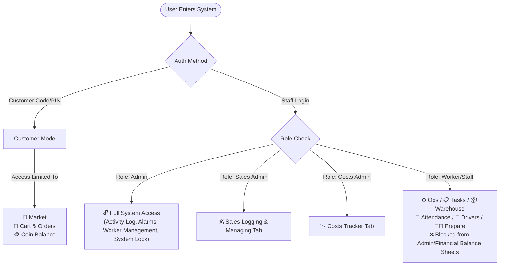
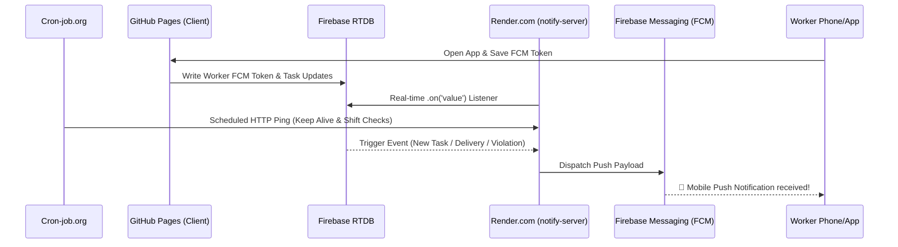

# 🚀 MVC Fresh / Burgeroov Dashboard — Comprehensive Project Architecture & Rules

This document serves as the **master knowledge guide** for the MVC / MVC Fresh / Burgeroov Admin & Customer Portal.

---

## 🏛️ 1. Infrastructure & Architecture

| Component | Technology | Role & Details |
| :--- | :--- | :--- |
| **Frontend Hosting** | **GitHub Pages** | Static client app (`index.html`, `app.js`, `style.css`, `translations.js`). Multi-language support (AR/EN). |
| **Database & Auth** | **Firebase Realtime Database (RTDB)** | Central real-time data sync across multi-company nodes (`companies/burgeroov`, `companies/mvc`, `companies/mvcfresh`). |
| **Push Daemon** | **Render.com (`notify-server`)** | Node.js Express server listening to Firebase RTDB event streams in real-time. Dispatches FCM push notifications for tasks, orders, violations, and rewards. |
| **Serverless Triggers** | **Firebase Cloud Functions** | `notifyWorkerOnUpdate` & `notifyWorkersOnGeneralTask` for secondary background triggers. |
| **Scheduled Tasks** | **Cron-Job.org** | External automated cron runner that pings Render endpoints & triggers automated shift checks, daily balance resets, and reminders. |

---

## 📑 2. Dashboard Tabs & Navigation Structure

The top navigation bar contains 16 specialized functional views (`switchTab(tabName)`):

1. **⚙️ Ops (`view-ops`)**: Operational home screen. Shift check-in/out, live shift clock, top actions, active order shortcuts.
2. **🏆 Ranks (`view-ranks`)**: Employee leaderboard, rating scores, monthly stars, and recognition badges.
3. **📅 Attendance (`view-attendance`)**: Clock-in/out logs, shift durations, overtime calculation, late penalties & violation records.
4. **📋 Tasks (`view-tasks`)**: Worker job catalog, task assignment, progress state (pending/in-progress/done), timer tracking.
5. **📦 Warehouse (`view-warehouse`)**: Inventory catalog, category filters, stock quantity adjustments, Excel file import (`all_excel_products.json`, `remaining_products.json`).
6. **🚚 Drivers (`view-drivers`)**: Driver status board (active, delivering, available), delivery provisions tracking, order assignments.
7. **💰 Finance (`view-finance`)**: Company financial dashboard, worker advances/loans tracking, salary deductions, reward bonuses.
8. **📊 Summary (`view-summary`)**: High-level operational analytics, financial summary charts, performance KPIs.
9. **📢 Adverts (`view-adverts`)**: Internal company announcements, promotional banners, notice boards.
10. **📝 Notes (`view-notes`)**: Internal team documentation, attachments, shared memo notes.
11. **📜 Activity Log (`view-activity`)** *(Admin-Only)*: Immutable audit trail logging sensitive system changes, deletes, and locks.
12. **💰 Managing / Sales (`view-managing`)** *(Admin / Sales-Admin)*: Daily sales entry, past-day sales logging, cash deposits, direct spend logging.
13. **📉 Costs (`view-costs`)** *(Admin / Costs-Admin)*: Operational expenses tracker, cost categorization, expenditure reports.
14. **⏰ Reminders (`view-reminders`)** *(Admin-Only)*: Scheduled system Alarms & alert reminders.
15. **🏪 Market (`view-market`)**: Digital store for products & coins redemption.
16. **👨‍🍳 Prepare (`view-prepare`)**: Kitchen & assembly line preparation view to process customer/market orders in sequence.

---

## 🔒 3. Roles, Permissions & Worker Rights

Access control is strictly governed by `currentUser.role` and `currentCustomerSession`.

### Worker Rights vs. Admin Controls
* **Workers CAN**: Clock in/out, view & complete assigned tasks, accept group jobs, request financial loans/advances, view inventory in Warehouse, view Ads/Notes, process orders in Prepare tab, update driver delivery status.
* **Workers CANNOT**: Access Activity Logs, create/delete worker profiles, unlock/lock system violations, delete inventory folders, view master company profit/loss finance tabs, edit sales/cost records without Sales/Costs Admin privileges.

---

## 🔑 4. Customer Access by Code / PIN (`mvc_customer_session`)

* **No Password Signup**: Customers access the store using a **Customer Session Code** (e.g. 4-digit code or custom customer ID).
* **Code Verification**: Matches against `publicCustomerCodes` (or `localCustomerRegistry`) synchronized in real time from Firebase RTDB.
* **Persistence**: Saved in `localStorage.setItem('mvc_customer_session', ...)` containing `{ code, coins, name, company }`.
* **UI Isolation**: `applyCustomerModeUI()` locks the navigation bar, hiding employee tabs, exposing only the Market view, cart, and order history.
* **Real-time Coin Sync**: Listens to changes in `publicCustomerCodes/{code}/coins` so rewards/points update dynamically in real time without refreshing.

---

## 🆔 5. Firebase ID Architecture (Non-Sequential String Keys)

Instead of relying on numeric indices (e.g., `[0, 1, 2]`), items in Firebase RTDB are keyed by unique string IDs:

1. **Products (`getAllMarketProducts`)**:
   * Stored with custom string keys e.g. `mkt_excel_23_1` or Firebase Push IDs.
   * `getAllMarketProducts()` merges cache objects using `p.id || p.key || p._id`.
   * Preserves exact product identity even when sorting by `createdAt` or filtering by category.
2. **Workers (`parseWorkersSnap`)**:
   * Firebase snap can return an Array or Key-Value Object.
   * `parseWorkersSnap(snap)` safely extracts objects while retaining exact database keys/indices, protecting active task bindings (`jobs`), FCM tokens, and monthly stats (`violationsList`, `rewardsList`).

---

## ⚙️ 6. Render.com & Cron-job Integration Flow

